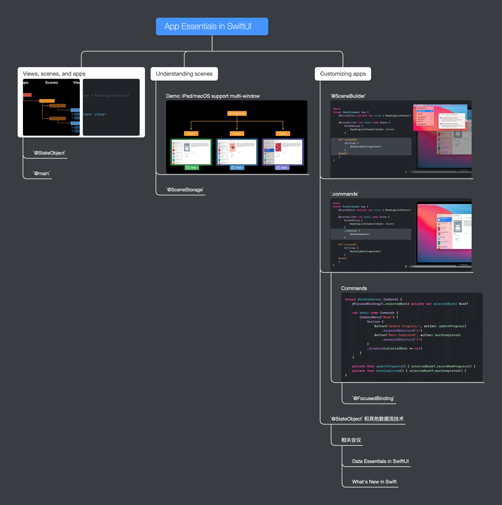
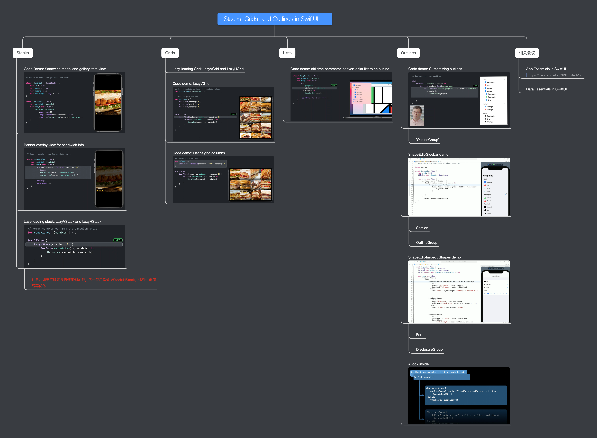
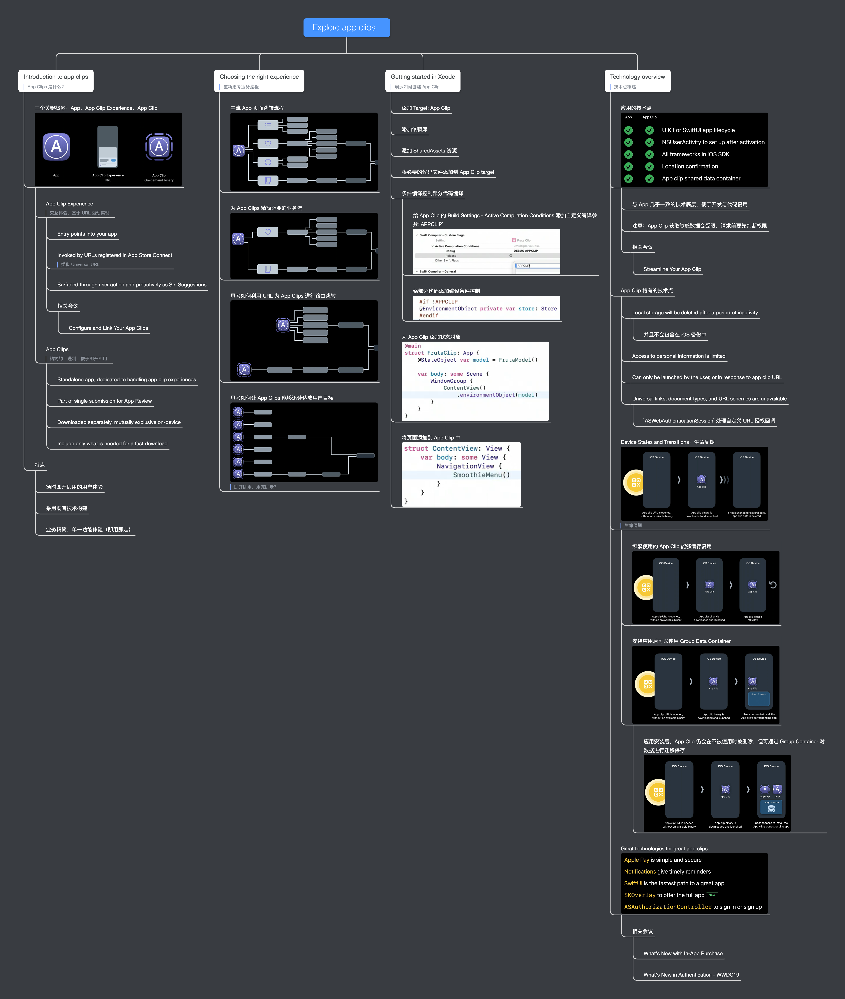

# WWDC20 观影记录

> 悦过留痕。

## SwiftUI

示例代码：[Creating and Updating Complications](./CreatingAndUpdatingComplications)

- [Introduction to SwiftUI](https://developer.apple.com/videos/play/wwdc2020/10119/)

  - 演示代码：[Sandwiches](./Sandwiches)

- [What's new in SwiftUI](https://developer.apple.com/videos/play/wwdc2020/10041/)

  

点击展开思维导图

    

- [App Essentials in SwiftUI](https://developer.apple.com/wwdc20/10037)

  

点击展开思维导图

        

- [Stacks, Grids, and Outlines in SwiftUI](https://wwdc.io/share/wwdc20/10031)

  

点击展开思维导图

        

- [Data Essentials in SwiftUI](https://wwdc.io/share/wwdc20/10040)

- [Build complications in SwiftUI](https://developer.apple.com/videos/play/wwdc2020/10048/)

- [Build Document-Based Apps in SwiftUI]()

- [Build SwiftUI Views for Widgets]()

- [Widgets Code-Along: Part 1-3]()

## App Clip - Apple 「小程序」

示例代码： [Fruta: Building a Feature-Rich App with SwiftUI](./FrutaBuildingAFeatureRichAppWithSwiftUI)

- [Explore app clips](https://developer.apple.com/videos/play/wwdc2020/10174)

  

点击展开思维导图

        

- [Configure and link your app clips](https://developer.apple.com/videos/play/wwdc2020/10146/)

- [Design great app clips](https://developer.apple.com/videos/play/wwdc2020/10172)

- [Streamline your app clip](https://developer.apple.com/videos/play/wwdc2020/10120)

- [Create app clips for other businesses](https://wwdc.io/share/wwdc20/10118)

## UICollectionView

示例代码： [Implementing Modern Collection Views](./ImplementingModernCollectionViews)

- [Advances in UICollectionView](https://developer.apple.com/videos/play/wwdc2020/10097/)
- [Lists in UICollectionView](https://developer.apple.com/videos/play/wwdc2020/10026/)
- [Modern cell configuration](https://developer.apple.com/videos/play/wwdc2020/10027/)
- [Advances in diffable data sources](https://developer.apple.com/videos/play/wwdc2020/10045/)

## Swift

- [What's New in Swift]()

## UI Typography

- [The Details of UI Typography]()

## Frameworks & Swfit Packages

- [Distribute binary frameworks as Swift packages](https://developer.apple.com/videos/play/wwdc2020/10147/)
- [Swift packages: Resources and localization](https://developer.apple.com/videos/play/wwdc2020/10169/)

--------------------------------------------------------------------------------

All rights reserved by apple.com
